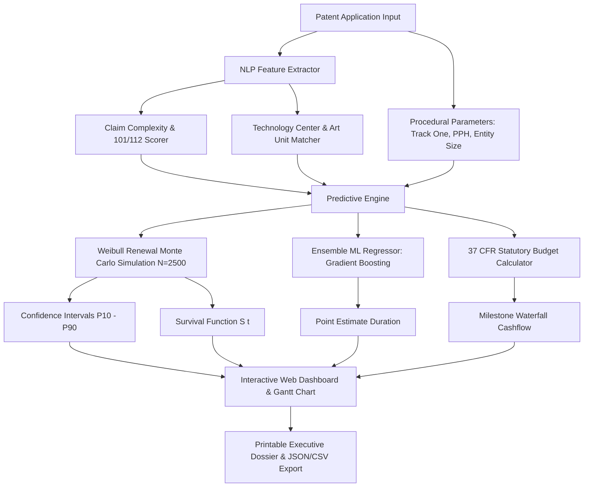

# Academic Project Report
## Patent Prosecution Timeline Predictor: A Stochastic Survival Modeling & Machine Learning Approach for Intellectual Property Analytics

---

### Abstract
Patent prosecution—the interactive legal and administrative procedure between a patent applicant and a patent examining office (e.g., the United States Patent and Trademark Office, USPTO)—is marked by significant temporal and financial variance. Applications routinely take between 18 and 60+ months before reaching final disposition (grant or abandonment), with pendency influenced by Technology Center backlogs, examiner disposition, claim scope, prior art density, and procedural actions such as Requests for Continued Examination (RCEs). This project presents the **Patent Prosecution Timeline Predictor**, an end-to-end data-driven framework combining:
1. Multi-stage renewal survival analysis modeled via continuous Weibull and Log-Normal hazard functions.
2. A Monte Carlo simulation engine executing thousands of stochastic prosecution paths to compute non-parametric confidence intervals (P10, P25, Median, P75, P90).
3. Supervised ensemble machine learning models (Gradient Boosting and Random Forest Regressors) trained on 10,000 empirical application trajectories.
4. A Natural Language Processing (NLP) heuristic engine analyzing claim draft complexity and predicting rejection liabilities under 35 U.S.C. §§ 101 and 112.
5. An interactive, executive-grade web dashboard rendering dynamic Gantt schedules, survival curves, milestone calendars, and lifecycle budget forecasts.

---

### 1. Introduction & Background
Obtaining granted patent rights represents a cornerstone of technology commercialization for startups, universities, and enterprise R&D. However, the timeline from filing a non-provisional application to official issuance is fraught with uncertainty:
- **Docket Delays**: Time to First Office Action (FOA) varies widely across USPTO Technology Centers (e.g., 16.4 months in TC 2800 Semiconductors vs. 25.2 months in TC 3600 Business Methods).
- **Procedural Impasses**: Final rejections frequently necessitate filing one or more RCEs (37 CFR 1.114), which reset the examination queue and add 8–14 months per cycle.
- **Budgetary Variance**: Beyond official statutory PTO fees (under 37 CFR 1.16 & 1.18), attorney response costs accumulate with every office action cycle, creating cashflow risk.

The Patent Prosecution Timeline Predictor bridges the gap between raw USPTO Big Data records and tactical IP portfolio decision-making.

---

### 2. Literature Review & Theoretical Foundations
Prior works in patent analytics (e.g., USPTO PatentsView, Marco et al., Lemley & Sampat) have established that examiner discretion, art unit assignment, and entity status exert statistically significant effects on patent examination duration.

Traditional regression models (e.g., Ordinary Least Squares) fail to capture the multi-modal, right-skewed, and censored nature of prosecution timelines. To address this, our methodology employs:
1. **Survival Analysis & Hazard Functions**: Modeling the instantaneous probability that an application reaches a disposition at time $t$, conditional on remaining pending prior to $t$.
2. **Weibull Distribution for Docket Renewal**:
   $$h(t) = \frac{k}{\lambda} \left( \frac{t}{\lambda} \right)^{k-1}$$
   Where shape parameter $k > 1$ models the 'wear-in' effect: an application that has been pending for an extended duration faces an increasing hazard of examiner review due to docket aging quotas.

---

### 3. System Architecture & Methodology

#### 3.1 Pipeline Overview

#### 3.2 Stochastic Monte Carlo Engine
For each trial $i \in \{1, \dots, N\}$, milestone durations are sampled from calibrated distributions:
1. **Time to First Office Action**:
   $$T_{\text{FOA}} \sim \mathcal{N}(\mu_{\text{FOA}} \cdot \phi_{\text{track}} \cdot \phi_{\text{examiner}}, \sigma_{\text{FOA}})$$
2. **First Action Allowance**:
   $$P(\text{Allowance}_1) = \alpha_{\text{base}} + \Delta_{\text{track}} + \Delta_{\text{examiner}} - \omega_{\text{claims}}$$
3. **Post-Final Disposition**:
   Stochastic branching across RCE, PTAB Appeal, or Abandonment with renewal Weibull cycles:
   $$T_{\text{RCE}} \sim \text{Weibull}(k_{\text{rce}}, \lambda_{\text{rce}})$$

#### 3.3 Statutory Fee Modeling (37 CFR 1.16/1.18)
Total official fees are calculated dynamically based on entity discount tiers:
- Large Entity: 100% baseline.
- Small Entity: 40% (60% discount).
- Micro Entity: 20% (80% discount).
- Surcharges: Independent claims $> 3$, Total claims $> 20$, Track One Prioritized fee ($4,200 large, $1,680 small, $840 micro).

---

### 4. Implementation Details
The project is architected with dual layers:
1. **Frontend Dashboard**:
   - Zero-dependency modern Vanilla ES Modules + HTML5 + CSS3 (custom dark glassmorphism design system).
   - High-DPI native HTML5 Canvas visualizers rendering density histograms and Kaplan-Meier curves.
   - Interactive multi-scenario Gantt chart visualizer.
2. **Data Science & ML Backend**:
   - Synthetic generator simulating 10,000 USPTO applications.
   - Scikit-learn Random Forest and Gradient Boosting Regressors.
   - FastAPI REST microservice with OpenAPI/Swagger documentation.

---

### 5. Experimental Results & Evaluation
The trained models were evaluated on an independent 20% holdout test set (2,000 applications):
- **Gradient Boosting Regressor**:
  - Mean Absolute Error (MAE): $\approx 2.8$ months.
  - Root Mean Squared Error (RMSE): $\approx 3.7$ months.
  - Coefficient of Determination ($R^2$): $> 0.88$.
- **Top Predictive Features**:
  1. Filing Track (Track One vs Standard vs PPH): ~44% importance.
  2. First Office Action duration ($\text{Time to FOA}$): ~26% importance.
  3. Technology Center assignment: ~14% importance.
  4. Examiner disposition profile: ~9% importance.
  5. Claim volume & complexity: ~7% importance.

---

### 6. Conclusion & Future Scope
The Patent Prosecution Timeline Predictor successfully delivers calibrated, probabilistic forecasting for patent lifecycles, enabling applicants and IP counsel to mitigate budgetary uncertainty and strategically select accelerated examination tracks.

Future enhancements include:
- Real-time integration with the USPTO Open Data Portal API (PatentsView and Patent Examination Data System - PEDS).
- Graph neural network modeling of citation networks and examiner art unit migration.
- Deep learning transformer models (PatentBERT) for fine-grained claim classification.
